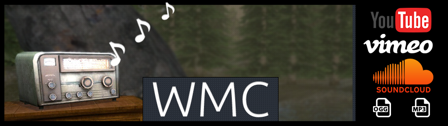

Wyozi Media Center is an addon for Garry's Mod, that adds extensive media playing capabilities. It is built to be easily extendable. For example displaying video uses an isolated MoonScript class, which means it is easy to display video on whatever prop/surface/screen location you want.

# Installation

Some of the WMC files use [MoonScript](http://moonscript.org/reference/command_line.html). You can download MoonScript compiler binaries for Windows from http://moonscript.org/bin/moonscript-0.2.6.zip.

You can run ```make.bat``` to compile all MoonScript files in WMC.
